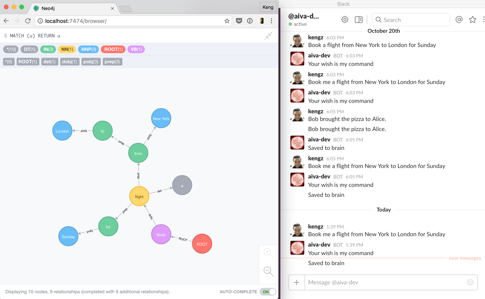
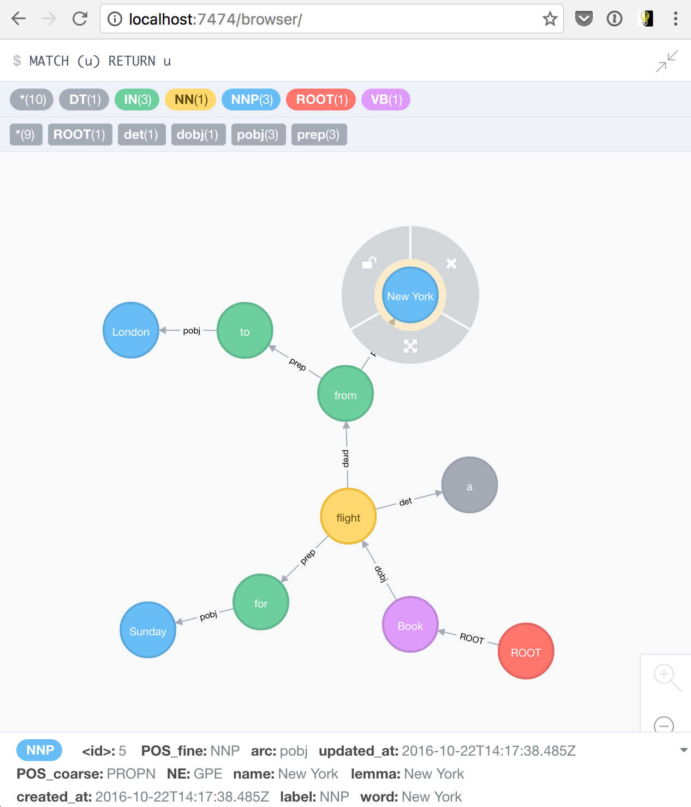

# CGKB [](https://badge.fury.io/js/cgkb) [](https://circleci.com/gh/kengz/CGKB)

<!-- [](https://codeclimate.com/github/kengz/CGKB) [](https://codeclimate.com/github/kengz/CGKB/coverage) -->

Contextual Graph Knowledge Base, basically a graph brain for my bot, based off [this crap](http://kengz.me/aiva/#contextual-graph-knowledge-base) *This is still a work in progress.*

## Installation

```shell
# install this npm package
npm i --save cgkb
# run
./node_modules/cgkb/bin/setup
```

This runs the background system dependency setups. You may need `sudo`. The full script can be inspected at [bin/setup](./bin/setup)

```shell
# If you prefer to run setup manually
# install spacy in python3
python -m pip install -U socketIO-client
python -m pip install -U spacy
python -m spacy.en.download

# Download and install neo4j
# Start the neo4j server
```

Then populate your db credentials in `config/db.json`.

## Usage

*Still a work in progress*. But check out the [CGKB branch of `aiva`](https://github.com/kengz/aiva/tree/cgkb) to see how it's being used in a bot.

Log on to the Neo4j interface to see the graph.



Inspect a node for more parsed NLP info.

